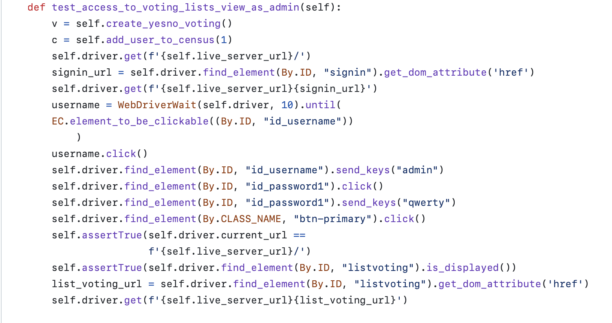
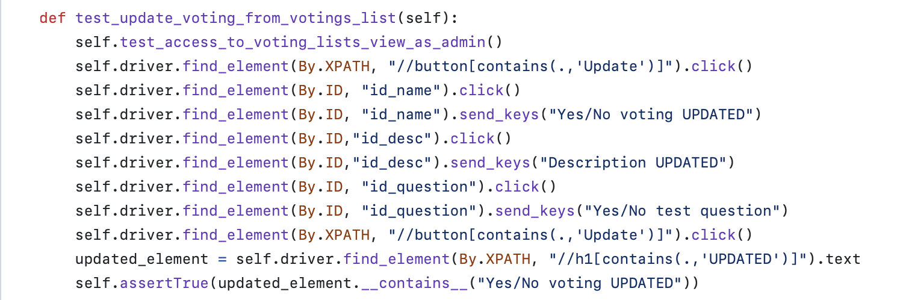
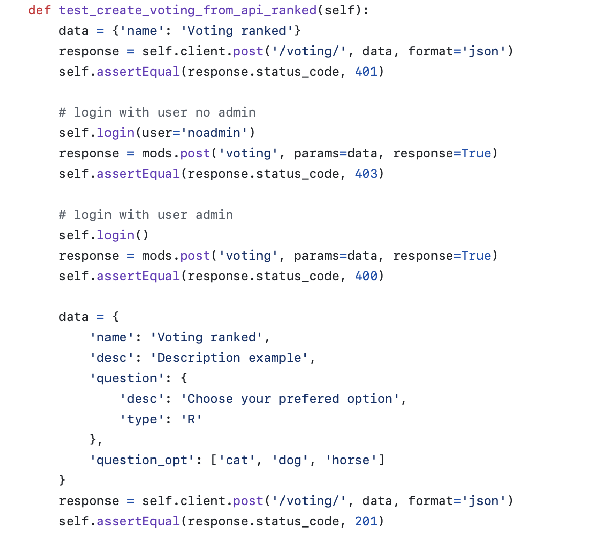
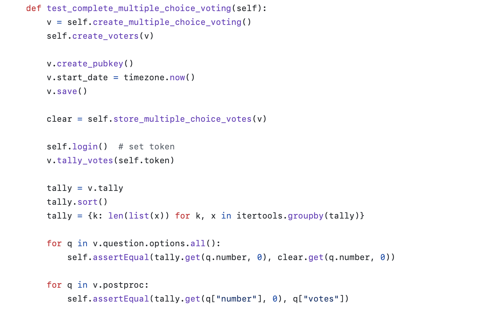
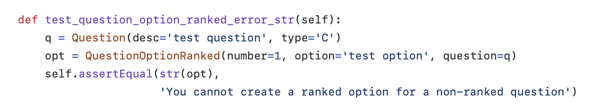

<h1 align="center">Informe de pruebas</h1>

Este documento recopila y detalla las pruebas implementadas en el proyecto de <b><i>decide-part-lorca</i></b>, proporcionando información crucial sobre la validación y funcionamiento de sus componentes. Además, presenta ejemplos prácticos que ilustran el uso correcto y las funcionalidades clave del proyecto.

## Tabla de Contenidos

1. [Introducción](#id1)
2. [Pruebas](#id2)
    1. [Pruebas de vistas dinámicas](#id2.1)
    2. [Pruebas de vistas estáticas](#id2.2)
    3. [Pruebas de integración](#id2.3)
    4. [Pruebas unitarias](#id2.4)
    5. [Pruebas de carga](#id2.5)
3. [Técnica de Diseño de Casos de Prueba](#id3)

 

### 1. Introducción
Para nuestro proyecto hemos decidido implementar tipos diferentes pruebas en función del módulo al que pertenezcan. En concreto:
- Voting: Pruebas de vistas dinámicas, estáticas, unitarias y de integración.
- Booth: Pruebas de vistas dinámicas y de carga.
- Store: Pruebas de vistas estáticas y unitarias.
- Authentication: Pruebas de vistas dinámicas y estáticas.
- Census: Pruebas de vistas dinámicas, estáticas, unitarias y de integración.
- Visualizer: Pruebas de vistas dinámicas.
Además, consideramos importante comentar que debido a que Github Actions algunas veces no ejecuta correctamente las pruebas de vista, hemos decidido no ejecutarlas de forma automática, sino que se ejecutan de forma manual en el entorno de desarrollo. Se ha utilizado `@nottest` para que no se ejecuten de forma automática.

 

### 2. Pruebas
 

#### 2.1. Pruebas de vistas dinámicas

- **decide/voting/test_configurator_selenium.py**

Estos tests pertenecen a una suite de pruebas de vista, ya que utilizan Selenium para simular la interacción de un usuario real con la interfaz de usuario en un navegador web. **Además, también son pruebas de persistencia, ya que almacenan información necesaria para las pruebas en la base de datos.**
 

#### 2.2. Pruebas de vistas estáticas

- **decide/voting/tests.py**

Prueba la funcionalidad expuesta a través de una API, verificando las respuestas y el comportamiento ante solicitudes a la API para crear una votación por preferencia.
 

#### 2.3. Pruebas de integración

- **decide/voting/tests.py**

Estas pruebas verifican la interacción entre componentes más grandes del sistema, en concreto el proceso de realización de una votación de opción múltiple completa.
 

#### 2.4. Pruebas unitarias

- **decide/voting/tests.py**

Estas pruebas se centran en funciones o métodos específicos para asegurar que cada unidad funcione correctamente. En este caso en concreto, una prueba negativa de creación de una pregunta de preferencia. **Además, también son pruebas sin persistencia, ya que no almacenan en la base de datos ninguna información**
 

#### 2.5. Pruebas de carga
Al igual que hemos visto en las prácticas, se han diseñado dos pruebas de carga, una para la votación de opción múltiple y otra para el censo. Para ver las pruebas de carga, acceda a la carpeta `loadtests` en el directorio raíz del proyecto. Para ejecutar las pruebas de carga, ejecute el siguiente comando:
- **Prueba de carga de votación de múltiples opciones**
- **Prueba de carga de censo**

 

### 3. Técnica de Diseño de Casos de Prueba
La mayoría de los tests siguen una estrategia basada en casos de uso. Cada método de prueba simula un caso de uso específico (por ejemplo, acceso como administrador, usuario no administrador, inicio o detención de votaciones, etc.). La división por funcionalidades indica un enfoque modular en el diseño de casos de prueba.
