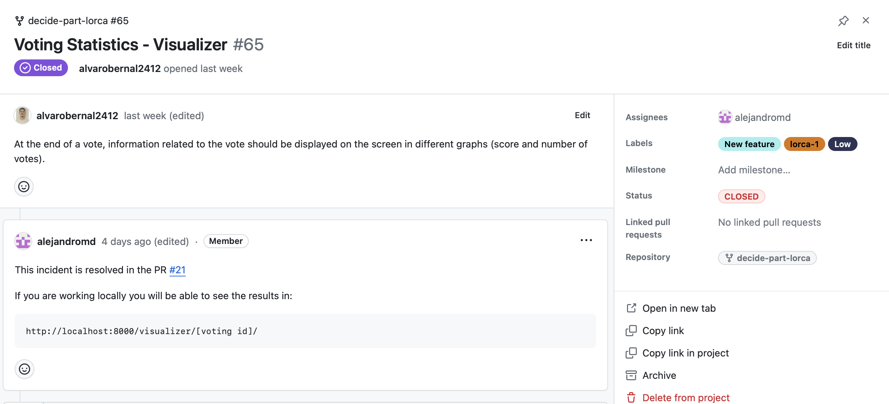
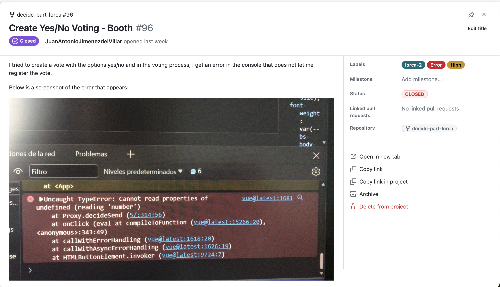
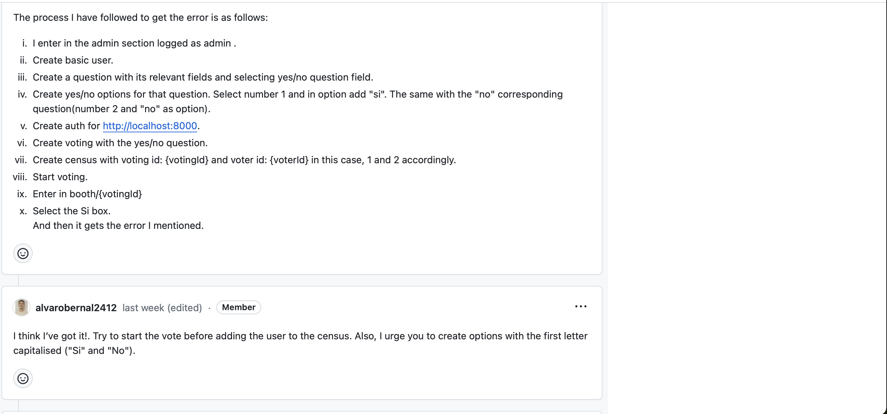
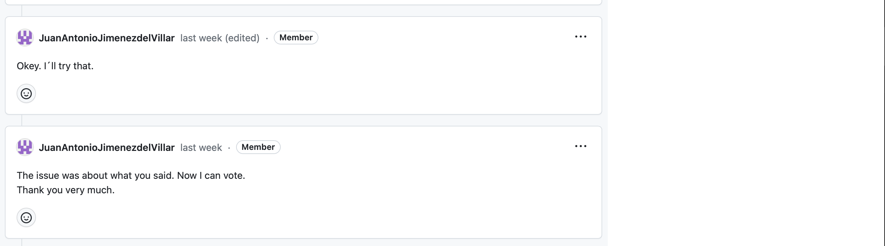
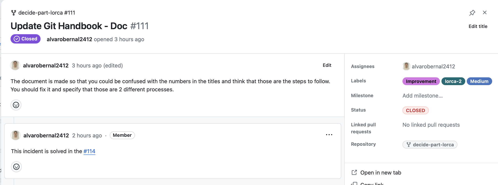

# Proceso de Gestión de Incidencias

## ¿Qué es una incidencia?

Una incidencia es un problema que se ha detectado, relacionado con el software o la documentación del proyecto. En nuestro caso, una incidencia también suponen tareas de implementación de nueva funcionalidad y mejoras en el repositorio (ya sean de documentación, github actions, etc)

## ¿Qué es el Registro de Incidencias?

El Registro de Incidencias es un Project Board de GitHub nombrado *Incidents*, en el que se registran todas las incidencias detectadas. Cada incidencia se representa como una tarjeta del tablero. El idioma empleado en el Registro de Incidencias es el inglés.

## ¿Qué hacer cuando se detecta una incidencia?

Cuando se detecta una incidencia, se debe seguir el siguiente proceso:

1. Se crea una Issue en el Registro de Incidencias, dentro de la columna *OPEN*,  indicando el nombre de la incidencia y el módulo al que hace referencia, separado por un guión. Por ejemplo: *Import/Export Census - Census*. Si la incidencia está relacionada con la documentación, en lugar de un módulo, se indica *Doc*. Por ejemplo: *Change documentation - Doc*.
2. Se asigna una Label a la Issue indicando el tipo de incidencia (*Error*, *Improvement* o *New feature*).
3. Se realiza una descripción detallada de la Issue según el tipo de incidencia:
    * *Error*: se indica cómo reproducir el error y se describe el comportamiento esperado. Si es necesario, se describe el entorno en el que se ha detectado el error.
    * *Improvement*: se describe el estado actual de la funcionalidad y cómo se debería mejorar.
    * *New feature*: se describe la nueva funcionalidad que se propone acotando el alcance de la misma.
4. Se asigna la Issue a una persona que será la encargada de revisarla y resolverla.
5. Se asigna una Label a la Issue indicando el grupo al que pertenece la persona responsable de revisarla y resolverla (*lorca-1* o *lorca-2*).

6. Se asigna una Label a la Issue indicando la prioridad de la incidencia (*High*, 
*Medium* o *Low*).

## ¿Qué hacer cuando se resuelve una incidencia?

Cuando se resuelve una incidencia, se debe seguir el siguiente proceso:

1. Crear una Pull Request hacia la rama *develop* del repositorio, en la que se incluya la modificación que resuelve la incidencia. Es importante que la Issue esté referenciada en la descripción de la Pull Request. Por ejemplo: *Fixes #1*.
2. Una vez que la Pull Request ha sido aprobada y fusionada, se mueve la Issue a la columna *CLOSED* del Registro de Incidencias.
3. Se cierra la Issue.

## Algunos ejemplos
### Incidencia de nueva funcionalidad

### Incidencia de error

### Incidencia de mejora

  

